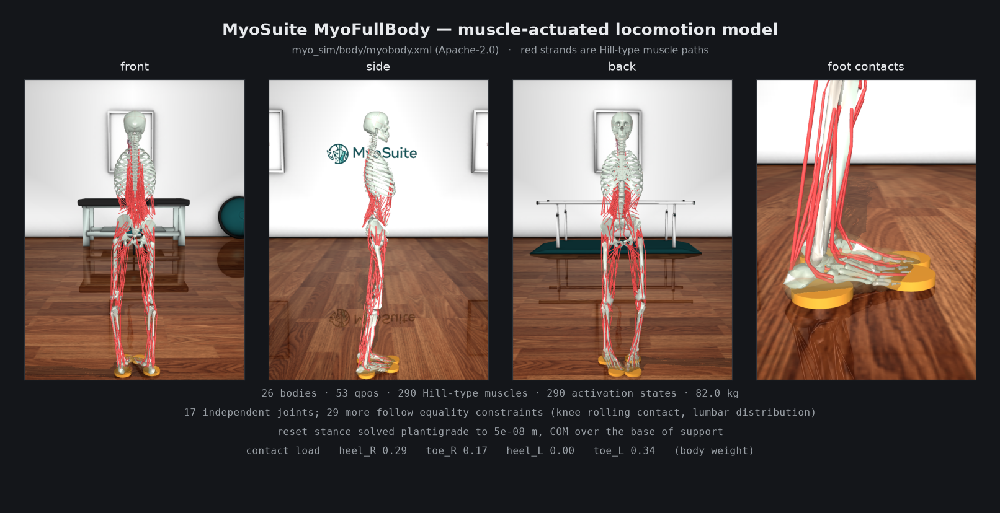

# Planar muscle-actuated locomotion (v5)

A **planar** full-body **musculoskeletal** locomotion environment on MuJoCo:
MyoSuite's MyoFullBody model -- 26 bodies, **290 Hill-type muscles**, 82 kg --
restructured to move in the sagittal plane only, like the `.hfd` cane model
this project is built around.



```
v5/
  myo_curriculum/
    rewards.py    loads v4's reward primitives (not a copy -- see below)
    stages.py     the stages, as data
    reference.py  the reference gait, mapped onto this model
    env.py        the single environment class
    __init__.py   gymnasium registration + variant helper
  run.ps1         PowerShell wrapper: absolute interpreter path, clean env
  scripts/
    validate_env.py  smoke test: frame, planarity, contact, reward, gradient
    run_reward.py    run an episode, printing the reward term by term
    render.py        multi-view still or rollout figure
  tests/          59 tests
  figures/        rendered PNGs (referenced above)
```

No crutches yet. This is the "plain muscle locomotion first" step; the crutch
curriculum lives in `v4/` and is unaffected.

## Setup

MyoSuite needs **Python 3.10+**, which v4 cannot use -- it is pinned to 3.9 by
`gym<0.22`, which sconegym requires. So v5 gets its own environment:

```powershell
pip install uv
uv python install 3.12

# Copy the interpreter into the project BEFORE creating the venv.
Copy-Item -Recurse "$env:APPDATA\uv\python\cpython-3.12.14-windows-x86_64-none" .python312

.python312\python.exe -m venv .venv-myo
.venv-myo\Scripts\python.exe -m pip install myosuite pytest matplotlib pillow
```

**Why the copy.** A venv built straight from uv's managed store is not
self-contained: `uv venv` leaves a 256 KB launcher in `Scripts/` that resolves
the real interpreter through `pyvenv.cfg`'s `home`, pointing back into
`%APPDATA%`. If that path is not reachable from a given shell -- a roaming or
redirected profile is enough -- every call fails with

```
No Python at '"C:\Users\...\uv\python\cpython-3.12.14-windows-x86_64-none\python.exe'
```

even with the venv activated, and even though the file exists and the same call
works from a different shell on the same machine. `python -m venv --copies`
does not help; on Windows venv still installs a launcher rather than a
standalone binary.

Copying the interpreter into the project makes `pyvenv.cfg` name only paths
under the repository. The test for it: rename uv's store and run something --
a self-contained venv is unaffected.

`.python312/` is gitignored, ~90 MB, and regenerated by the copy above.

Then, from `v5/`:

On PowerShell, `run.ps1` resolves the interpreter by absolute path and clears
the environment variables that can stop a venv interpreter starting:

```powershell
.
un.ps1 scripts
un_reward.py --stage W
.
un.ps1 scriptsalidate_env.py
.
un.ps1 -m pytest tests -q
```

Or activate it once and use `python` directly:

```powershell
..\.venv-myo\Scripts\Activate.ps1
python scripts
un_reward.py --stage W
```

Calling the interpreter by relative path works too, when the shell cooperates:

```bash
# watch the reward, term by term, every step
../.venv-myo/Scripts/python.exe scripts/run_reward.py --stage W

# every 10th step, 400 steps, random muscle activation
../.venv-myo/Scripts/python.exe scripts/run_reward.py --stage W --every 10 --steps 400 --policy random

# checks; figures; tests
../.venv-myo/Scripts/python.exe scripts/validate_env.py --stage W
../.venv-myo/Scripts/python.exe scripts/render.py
../.venv-myo/Scripts/python.exe -m pytest tests -q
```

`run_reward.py` prints one line per step -- the total with its share of the
maximum, then each term's **contribution** and its share of the maximum it
could contribute. A term at 100% is saturated and is no longer a source of
gradient:

```
step   12: reward +0.8149 ( 81.5% of max): alive 0.100 (100.0%)  tracking 0.005 (  2.6%)
           velocity 0.700 (100.0%)  | v +0.130 m/s  | phase 0.666  err 0.669 rad
```

Nothing here needs SCONE, sconegym, sconepy or a Hyfydy licence. The model
ships inside the `myosuite` wheel under Apache-2.0.

### The bigger MyoSkeleton is opt-in, and is your decision

`myobody.xml` is Apache-licensed and is what this package uses. MyoSuite can
additionally fetch a larger MyoSkeleton (~100 MB) from `myolab/myo_model`, but
only under a **non-commercial scientific research licence** that you have to
accept interactively:

```bash
../.venv-myo/Scripts/python.exe -m myosuite_init
```

That prompt is a licence agreement, so it is yours to accept, not something
this repo does for you. Nothing here depends on it. If you do accept it,
`MyoLocomotionEnv(model_path=...)` takes any MuJoCo muscle model, so switching
is one argument.

## What the model is

| | |
|---|---|
| bodies | 26 -- pelvis, full lumbar spine (L1-L5), torso, neck, head, both legs with patellae |
| qpos / qvel | 53 / 52 |
| muscles | 290 Hill-type, with 290 activation states |
| mass | 82.04 kg |
| speed | ~850 env steps/s single-threaded (`frame_skip=10`, so ~8.5k physics steps/s) |

**No arms.** `myobody.xml` is full-body from the pelvis up through the head,
but has no upper limbs. That does not matter for unaided locomotion and does
matter later: welding crutches needs forearms. When that time comes,
`myo_sim/body/myobody_simpleupper.xml` is the variant to use -- it has
`humerus/ulna/radius/hand` on both sides driven by 14 torque actuators plus 86
muscles, which is the same split v4 used (muscle-free torque arms holding the
crutches).

**Only 17 joints are independent.** The model has 46 non-root joints; 29 of
them are driven by equality constraints -- the knee's rolling contact
(`knee_angle_*_translation*`, `_rotation*`, `_beta_*`) follows `knee_angle_*`,
and the lumbar levels distribute the three trunk angles. `env.py` writes only
the 17 independent ones at reset and lets the solver resolve the rest;
perturbing a constrained joint directly would fight the constraint rather than
pose the model.

## What carries over from v4, and what does not

### The reward machinery carries over, by import

`v5/myo_curriculum/rewards.py` loads `v4/sconegym_crutch_v4/rewards.py` rather
than copying it. That file has no simulator, gym or Python-version dependency,
and it encodes design work worth keeping: every term is in `[0, 1]`, terms
compose as a weighted geometric mean so no term can be farmed in isolation, and
`termination_report()` proves the per-step reward cannot go negative. Copying
it was the exact failure v4 was written to undo, so v5 imports it by path --
which also skips v4's `__init__`, which imports gym 0.21.

### The terms do not carry over

Two kinds are new, because the body is:

- **Out-of-plane terms.** v4's model was strictly sagittal: every joint was a
  z-hinge, so falling sideways and turning were structurally impossible. Here
  they are the most common failure, hence `lateral` and `heading`, and
  termination checks trunk tilt as well as height.
- **An effort term.** 290 muscles are hugely overactuated -- many activation
  patterns produce the same motion and most are co-contraction a person would
  not use. `effort` selects among them. Nine torque actuators did not need it.
  It is deliberately loose (flat below a mean activation of 0.15): a tight
  effort penalty on an overactuated model suppresses motion before it
  suppresses co-contraction.

| stage | task | terms |
|---|---|---|
| **A** | hold a standing posture | height, upright, effort |
| **B** | walk forward at 1.2 m/s | + velocity, lateral, heading |

Stage A has **no velocity term at all**, rather than a velocity term with a
target of zero. A zero target rewards freezing, and would make the A→B
transition a discrete change in what the reward measures.

### Actions are activations, not torques

The policy emits `[-1, 1]` and the environment maps it to activation `[0, 1]`,
so **a zero action is half activation, not rest.** v4's action rate limiter is
kept, and `prev_action` stays in the observation for the reason v4 documents.

## Planar, like the `.hfd`

The `.hfd` is a 2-D model: a planar root (`pelvis_tx`, `pelvis_ty`,
`pelvis_tilt`) and sagittal joints. MyoFullBody ships as a 3-D body with a free
root, where lateral balance and heading are extra failure modes a policy has to
solve before it can start walking at all. Removing them is the largest single
reduction in difficulty available here, and it is what the source model does.

Three changes, applied through `MjSpec` at construction:

| | |
|---|---|
| **free root -> three joints** | slide x (forward), slide z (up), hinge y (sagittal pitch), named as in the `.hfd`. No sideways translation, no yaw, no roll. |
| **8 out-of-plane joints pinned to 0** | hip adduction and rotation, subtalar, lumbar lateral bending and axial rotation -- by equality constraint, so no reference dangles. |
| **two contact balls per foot** | as in the `.hfd`. See below. |

The eight were measured, not guessed. Perturbing each independent joint by
0.15 rad and recording how far any body left the sagittal plane:

| joint | out-of-plane displacement |
|---|---|
| `hip_adduction_r/l` | 0.127 m |
| `lat_bending` | 0.089 m |
| `hip_rotation_r/l` | 0.021 m |
| `subtalar_angle_r/l` | 0.019 m |
| `axial_rotation` | 0.015 m |
| `ankle_angle_r/l` | 0.0046 m |
| `knee_angle_r/l` | 0.0012 m |
| `mtp_angle_r/l` | 0.00016 m |
| `flex_extension` | 0.000003 m |

The clean break falls after `axial_rotation`. Ankle, knee and mtp are left
free: their residual obliquity is real anatomy, and with a planar root it
cannot accumulate into lateral motion. What "planar" guarantees here is that
**the body cannot leave the plane or fall out of it**; individual segments
still wander up to about 2.7 cm under random full-range activation, far less
under anything resembling a policy. Projecting those axes onto the sagittal
plane would make it exactly planar at the cost of the anatomy.

**Twelve independent degrees of freedom** remain: three at the root,
`flex_extension`, and hip/knee/ankle/mtp per leg. The action space is unchanged
at 290 muscles, so the model is now far more overactuated relative to its dofs
than before -- which is the regime DEP-RL was built for.

The `lateral` and `heading` reward terms are gone with the third dimension.
Both were also satisfied by standing still, so dropping them raises every
remaining term's exponent in the geometric mean.

### A correction

An earlier version of this package reported the right femur as **23.5 mm
shorter than the left** and built an asymmetric stance around it, with
`lat_bending` taking up the difference. That measurement was wrong. It set
`knee_angle` to -0.05, which is outside that joint's `[0, 2.0944]` range, so
the knee's coupling polynomials -- which drive `translation1/2` and
`rotation2/3` -- were evaluated off their domain and returned different
nonsense per side.

**The model is exactly left/right symmetric**, to floating-point precision.
`test_model_is_left_right_symmetric` pins it. That is what lets the stance be
solved symmetrically now: one set of leg angles for both legs, six unknowns
against four residuals, converging to about `1e-16`.

## The standing stance is solved, not inherited

The model ships with a **mid-stride keyframe rather than a stance** -- hips
0.43 rad apart, feet 0.23 m apart along the facing direction, trunk flexed
30 degrees -- and that keyframe is dropped anyway when the free root is
replaced, so the pose has to be constructed.

`_solve_stance_pose()` solves it by damped Gauss-Newton against:

- the heel **and** toe of one foot at `z = 0` (plantigrade; symmetry gives the
  other foot for free),
- the COM horizontally over the **base of support**, and
- the trunk axis vertical.

Unknowns are hip, knee and ankle angle, pelvis height, pelvis tilt and trunk
flexion. Six against four, solved least-norm, converging to about `1e-16`.

Reset randomisation then breaks it, two ways: 0.02 rad at the ankle tilts a
0.2 m foot by 4 mm and lifts the heel, and a hip or knee perturbation moves a
whole foot. `_seat_feet()` projects each leg back onto "heel and toe at
`z = 0`" through its own hip, knee and ankle.

Measured over 12 resets: **both heels on the floor every time** (worst gap
1e-9 m), **both heels carrying load every time**, total contact load
0.55-0.62 body weights, COM over the base to 6e-4 m. The 3-D version left one
heel at zero force on most resets -- four coplanar contacts against three
equilibrium equations is the wobbly-table problem -- and the symmetric planar
stance is not subject to it.

The heels still unload within a few steps, because the body pitches forward.
Holding the stance is stage A's job, not the reset's.

## Foot contact: two balls per foot, as in the cane model

The `.hfd` cane model this project is built around gives each foot exactly two
contact spheres -- `heel` and `toe`, radius 0.03, plus one per crutch tip.
MyoSuite's MyoFullBody instead wraps each foot in five capsules and an
ellipsoid: a rolling sole, with no clean heel/toe split to read gait phase
from. This environment replaces MyoSuite's scheme with the cane model's two
balls, so contact behaves the way the rest of the project assumes.

The swap happens through `MjSpec` at construction, so there is no second model
file to keep in step with the `myosuite` package and no mesh paths to rewrite.
The MyoSuite geoms are not deleted, only taken out of collision, so the foot
still renders as a foot. `ball_contacts=False` restores the stock scheme for a
comparison; the heel/toe grouping follows the flag.

The balls are **massless** (`density=0`): left at MuJoCo's default they added
0.3 kg and shifted the feet's inertia, which is not what a contact primitive
should do. Their positions come from this model's own sole geometry rather
than the `.hfd` numbers, whose calcn frame is scaled and oriented differently;
`BALL_CONTACTS` documents the derivation and a test pins the stance they give.

The heel ball sits on `calcn` and the toe ball on `toes`. The `.hfd` puts both
on `calcn`, but its own comment says why that was free -- "the mtp joint here
is locked 0..0 anyway, so this changes nothing kinematically". Here mtp is a
live joint with muscles crossing it, so the equivalent choice is to let the toe
ball follow the toes.

### What the swap exposed

Reducing eleven contact geoms to four made a latent defect obvious. The solved
stance had the feet **0.055 m apart laterally** -- narrower than one foot is
wide -- because `hip_adduction` was pinned to zero and nothing constrained
stance width. MyoSuite ships **14 leg-to-leg collision pairs**, and those
bypass `contype`/`conaffinity` entirely, so disabling the foot geoms did not
disable them: the foot-to-foot pair fired with **569 N** of spurious force,
more than half body weight, swamping the real ground reaction.

The stance solve now constrains stance width (0.17 m, a touch wider than the
model's 0.154 m hips) and fore-aft alignment. Left free the latter settled on a
0.110 m **split stance**, which loads the feet diagonally -- one heel and the
opposite toe.

### What is guaranteed, and what is not

All four balls **touch** the floor at every reset, to about 1e-7 m, with no
self-collision. Whether a given ball also **carries load** is the solver's to
decide: four coplanar point contacts against three equilibrium equations is
indeterminate -- the wobbly-table problem -- so one of them routinely comes out
at zero even while touching. That is reported by `validate_env.py` rather than
asserted.

And the heels unload within a few steps, because the body pitches forward.
Holding the stance is stage A's job, not the reset's.

## Stage W: the walking reward

| | asked for | implemented | when |
|---|---|---|---|
| falling | big penalty | early termination + `fall_penalty = 5.0` | on fall |
| surviving 10 s | 0.1 | `alive = 0.10`/step over 1000 steps | per step |
| following the trajectory | 0.2 | reference tracking, weight 0.20 | per step |
| moving forward | 0.7 | `0.70 × 1000 × smoothstep(travel, 0, 1 m)` | **at the end** |

```
per step    alive 0.10  +  tracking 0.20                        =    0.30
at the end  forward 0.70 × 1000 × smoothstep(travel, 0, 1.0 m)  =  ≤ 700
--------------------------------------------------------------------------
a perfect 10 s episode                                          =   1000
```

Same proportions as a flat 1.0/step reward -- alive 100, tracking 200, forward
700 -- with the forward share moved to the end.

Three departures from the literal spec, each for a reason:

**Forward progress is paid terminally, against distance.** Per step it is
farmable by *falling*: any topple produces v > 0.1 m/s and the term saturates
at 100% immediately. Measured at the end against distance covered it is not --
a fall ends the episode after a few centimetres, and `smoothstep(0.013, 0, 1)`
is 0.001. On a toppling rollout the old form collected the full 0.70 every
step; the new one pays **0.35 of 700**.

`travel` is the **root translation** (`pelvis_tx`), not the COM. On that same
rollout the two disagree in sign -- pelvis_tx goes −0.032 m while the whole-body
COM goes +0.028 m, because the legs swing forward as the model falls. Root
translation is the model's actual ground track, it is the reference's own
progress variable, and it cannot be inflated by throwing limbs forward.

**A bonus paid only at 10 s is too sparse.** 1000 steps is a long way to carry
credit. Survival is a `0.10`/step alive bonus instead -- same total, dense
signal.

**A big fall penalty freezes the policy.** With early termination, falling
already forfeits the rest of the episode. That *is* the penalty. A large
explicit one on top makes standing still beat any policy that risks moving.
`RewardSpec.termination_report()` checks this.

### Additive, not geometric

v4 composes terms as a weighted geometric mean so no term can be farmed alone.
Here that would be wrong: tracking is near zero early in training, and
geometrically it would gate velocity to zero too, so neither would learn.

Stage W is additive. The weights already encode the priority -- standing still
scores 0.10, moving 0.80, moving on the reference 1.00 -- and because
`alive + shaping_scale = 1` with weights summing to 0.90, the weighted
arithmetic mean puts velocity's maximum at exactly 0.70 and tracking's at 0.20.

### The reference

`reference.py` maps `models/reference/gaitTracking_solution_raw.sto` onto this
model. Two parts of that mapping are not identities:

- **`pelvis_tilt` is sign-flipped.** The `.hfd` uses OpenSim's convention where
  negative is a forward lean; this model's hinge is positive-forward. Measured,
  not assumed. Everything else agrees, which is why this reference fits the
  MyoSuite joint ranges -- **0 of 9 dofs out of range** -- when it did not fit
  the `.hfd`'s at all (v4 README, section 11).
- **`pelvis_ty` is a height, not a joint value.** Here it is a slide offset
  from the root body, and the offset depends on `pelvis_tilt`, so the reference
  height is solved against the posed model. RSI lands the pelvis to 1e-16 m.

The record is not exactly cyclic -- it is tracked from real data. The best wrap
is frame 195 (4.16 s), where the pose differs from frame 0 by 0.30 rad over
nine dofs. Tracking dips briefly at the seam; `Reference(loop_end=...)` moves it.

**RSI** starts each episode at a uniform random phase, posed on the reference.
The feet are deliberately *not* seated -- forcing a mid-swing frame plantigrade
would corrupt it. **Early termination** fires above 0.80 rad RMS joint
deviation, so the policy never banks alive and velocity return from a state
that has nothing to do with the reference.

### One thing to know before training

The terminal payment is up to **700** against a per-step reward of at most
**0.30**. GAE propagates it correctly, but the value function now has to span
four orders of magnitude, and a single terminal number carries most of the
episode's return -- which is real variance in the advantage estimate. Normalise
returns (PPO implementations usually do) and watch the value loss.

If that variance bites, the dense equivalent is to pay `Δtravel` each step
instead. It telescopes to the same total over an episode, is policy-invariant
as potential-based shaping, and cannot be farmed by falling either -- you only
collect what you actually cover. The only thing it loses is the saturation at
1 m, which stops a sprint outscoring a walk.

## Three things that were wrong first, and are now tested

These are the bugs a training run would have hidden rather than surfaced, so
each has a regression test.

**1. The body frames are locally y-up inside a z-up world.** The model's world
is z-up, but its body frames carry the OpenSim convention -- the torso frame's
own `+y` is what points at the sky. Reading a body's local `+z` as "up"
measured an **89° trunk tilt on a model standing perfectly straight**, and
every episode terminated on step 1. Posture is now derived from the
pelvis-to-head vector and heading from the hip-to-hip vector, which are
unambiguous whatever the frame convention.

**2. The neutral pose faced 109°, not +x** (in the 3-D version). `initial_forward_velocity` was
being written to the root's world-x dof, so stage B launched the model mostly
*sideways* -- the `lateral` term scored 0.23 at reset, punishing the
environment's own initial condition. The push now goes along the model's facing
direction, and everything directional is measured against the heading recorded
at reset. `lateral` now scores 1.00 there.

**3. Stage B's velocity target had no gradient from standstill.** At the
initial sigma of 0.35 against a 1.2 m/s target, a motionless model scored
`exp(-(1.2/0.35)²) = 7e-6`, which the term floor then flattened completely.
This is the same trap v4's stage D fell into and its README documents. Sigma is
now 0.80, so standstill scores 0.11 and every 0.1 m/s gained is worth
something. `validate_env.py` checks every term is off its floor at reset.

## Not done

In the order I would tackle them:

1. **Hold the stance.** The reset is now a balanced plantigrade stance, but
   nothing keeps it: the model pitches forward and unloads both heels within
   about six steps. That is what stage A is for.
2. **Train something.** There is no trained policy yet -- the rollouts in
   `render.py` are an untrained body falling over, which is what an untrained
   muscle body does. MyoSuite ships `myoLegWalk-v0` baselines worth reading
   first, and DEP-RL is designed for exactly this overactuation (it was v4's
   "Not done" item 3, and unlike v4's 9-torque model this body is the kind
   DEP-RL targets).
3. **A reference trajectory and RSI.** v4's `trajectory.py` loads OpenSim
   `.sto` files and its keyframe/chaining curriculum is the part most worth
   porting. It needs a reference whose dof names and sign conventions match
   this model -- and note the warning in v4's README section 11 about the
   existing reference disagreeing with the model on knee sign.
4. **Arms, then crutches**, on `myobody_simpleupper.xml`.
5. **Pathological gait.** MyoSuite ships `myoFati*` (fatigue) and `myoSarc*`
   (sarcopenia) environment variants. Those are the mechanism for modelling
   impairment directly, rather than inferring it from an assistive device.
